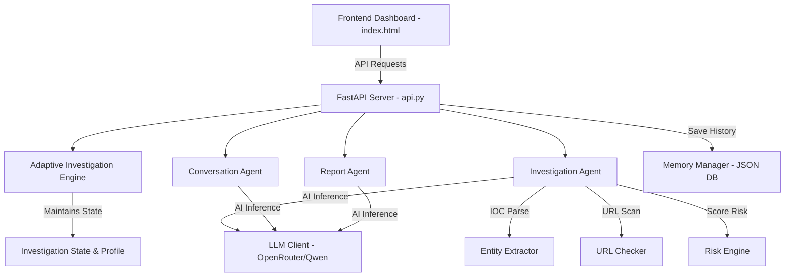

# 🛡️ TraceAI - Undercover Scam Investigation Dashboard

TraceAI is a production-ready, AI-driven scam investigation platform. It provides an automated undercover agent capability to engage with online scammers, extract Indicators of Compromise (IOCs), perform risk scoring, and compile detailed incident reports for security analysts.

---

## 📖 Table of Contents
- [Overview](#overview)
- [Key Features](#key-features)
- [Architecture](#architecture)
- [Technology Stack](#technology-stack)
- [Environment Variables](#environment-variables)
- [Local Installation & Run](#local-installation--run)
- [Running Unit Tests](#running-unit-tests)
- [Production Deployment](#production-deployment)

---

## 🔍 Overview

TraceAI addresses the difficulty of active scam investigation by placing an AI-driven proxy in the communication path. It analyzes scam payloads, generates a custom victim profile tailored to target the threat context (e.g., banking scams, job recruiter scams, investment schemes), and performs automated undercover chats. During the chat, it dynamically extracts indicators like phone numbers, URLs, bank accounts, and email addresses, providing security teams with verified evidence to take down scam infrastructure.

---

## ✨ Key Features

- **Dynamic Identity Generation**: The Adaptive Investigation Engine automatically shapes realistic victim personas depending on the detected threat context.
- **Undercover Engagement**: Auto-routes conversations to safely extract scam credentials and details.
- **IOC Extraction**: Real-time identification of scam links, bank accounts, emails, phone numbers, and UPI IDs.
- **Risk Score & grading**: Evaluates threat severities on a 0-100 scale using composite rules.
- **Interactive Console & Live Timeline**: Displays real-time agent updates and trace logs.
- **Markdown Report Generation**: Compiles structured security intelligence reports for export.

---

## 🏗️ Architecture

The platform is split into a lightweight FastAPI backend and a responsive, vanilla-styled single-page HTML frontend.



---

## 💻 Technology Stack

* **Backend**: Python 3.10+, FastAPI, Uvicorn
* **Frontend**: HTML5, Vanilla CSS3 (Slate & Emerald custom theme, dark/light toggle), Vanilla JavaScript
* **AI/LLM**: OpenAI API integration via OpenRouter (`qwen/qwen3-32b` default model)
* **Testing**: Python unittest

---

## 🔑 Environment Variables

To run the application, configure a `.env` file at the root containing:

```env
OPENROUTER_API_KEY=your-openrouter-api-key
LLM_MODEL=qwen/qwen3-32b
```

---

## 🚀 Local Installation & Run

### Prerequisites
- Python 3.10+
- Git

### 1. Clone & Set Up Directory
```bash
cd kaggle-capstone
```

### 2. Create and Activate Virtual Environment
```bash
# Windows
python -m venv venv
.\venv\Scripts\activate

# macOS/Linux
python3 -m venv venv
source venv/bin/activate
```

### 3. Install Dependencies
```bash
pip install -r requirements.txt
```

### 4. Run Backend API
```bash
python -m backend.api
```
The FastAPI server will start on [http://127.0.0.1:8001](http://127.0.0.1:8001).

### 5. Serve Frontend
```bash
# Start a simple HTTP server to serve the static frontend
python -m http.server 8000 --directory frontend
```
You can now open [http://127.0.0.1:8000](http://127.0.0.1:8000) in your web browser.

---

## 🧪 Running Unit Tests

We have included a mock-based unit test suite which runs offline without requiring API keys:
```bash
python -m unittest discover -s tests
```

---

## ☁️ Production Deployment

### Backend (Render)
1. Create a **Web Service** on Render.
2. Link your GitHub repository.
3. Configure the following settings:
   - **Environment**: `Python`
   - **Build Command**: `pip install -r requirements.txt`
   - **Start Command**: `uvicorn backend.api:app --host 0.0.0.0 --port $PORT`
4. Add the following **Environment Variables** in Render settings:
   - `OPENROUTER_API_KEY` = `your-actual-api-key`
   - `LLM_MODEL` = `qwen/qwen3-32b`

### Frontend (Vercel)
1. Deploy the `frontend/` directory to Vercel as a static site.
2. Vercel will automatically host it and provide a production domain.
3. Update `API_URL` inside `frontend/index.html` to point to the newly deployed Render backend URL.
